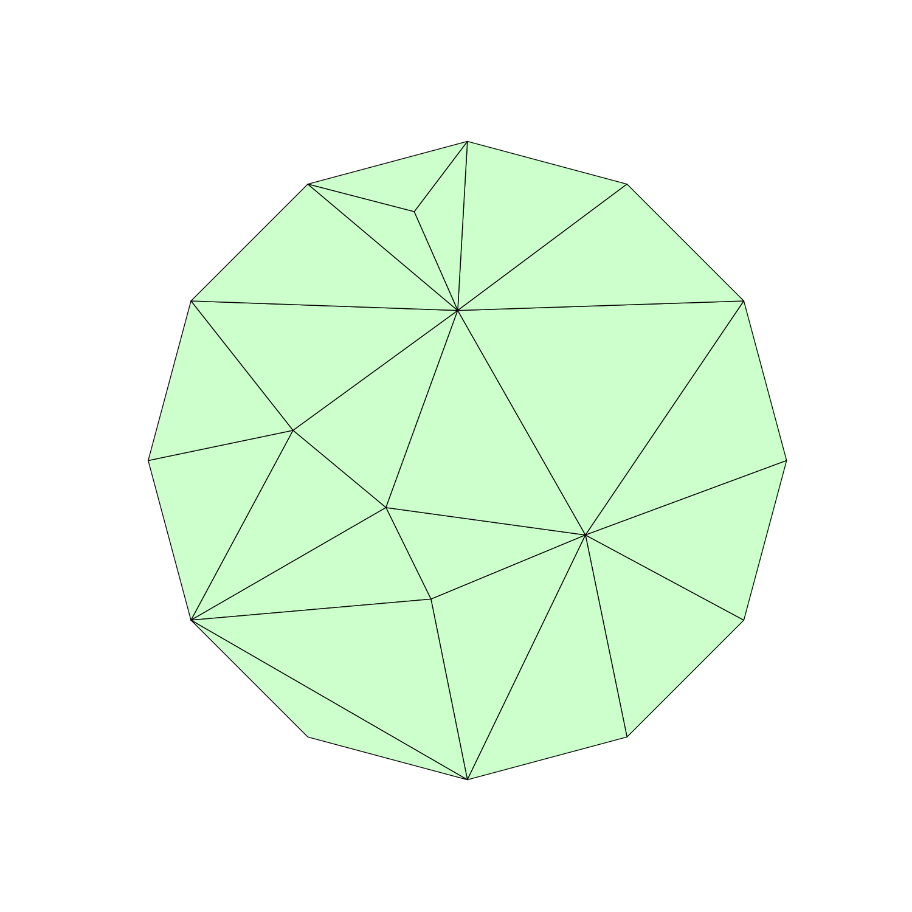

# TriMeshGame

[](https://github.com/ArjunNarayanan/TriMeshGame.jl/actions/workflows/CI.yml?query=branch%3Amain)

Credit to [Per-Olof Persson](persson.berkeley.edu) for giving me the idea and helping me out with this project.

This package implements connectivity editing operations on Triangular Meshes. A triangular mesh is a 2D mesh where all the elements are triangles. You can use the [MeshPlotter.jl](https://github.com/ArjunNarayanan/MeshPlotter.jl) for visualization. Check out the related [QuadMeshGame.jl](https://github.com/ArjunNarayanan/QuadMeshGame.jl) package for a similar approach with quadrilateral meshes.

# Introduction

A triangular mesh can be defined by providing the coordinates of vertices and the connectivity of each triangle. As an example, let's create a simple hexagonal mesh,

```julia
s = sqrt(3)/2
vertices = [0.0  1.0  0.5   -0.5  -1.0  -0.5  0.5
            0.0  0.0  s      s     0.0  -s    -s]

connectivity = [1  1  1  1  1  1
                3  4  5  6  7  2
                4  5  6  7  2  3]

mesh = TM.Mesh(vertices, connectivity)
```

`vertices` is expected to be a `2 x num_vertices` matrix of vertex coordinates, `connectivity` is expected to be a `3 x num_triangles` matrix of integers representing the connectivity of each triangle (one triangle per column). The vertices are assumed to be in counter-clockwise order. The order of the connectivity can be used to locally order the edges of each triangle.

The `Mesh` object is dynamic. The number of vertices and triangles can change based on the connectivity editing operations described later. Hence we allocate a larger buffer to store the vertex coordinates and triangle connectivity and we keep track of **active vertices** and **active triangles**. While visualizing, we should only supply the active vertices and active triangles to the plotter. We can do this as follows,

```julia
MP.plot_mesh(TM.active_vertex_coordinates(mesh), TM.active_triangle_connectivity(mesh), number_vertices = true, number_elements = true, internal_order = true)
```


The red numbering in the above figure refer to the local numbering of vertices in each quad. Each vertex can be uniquely associated with an edge in many ways - we choose to associate the edge opposite the vertex. So for example, local edge 1 in triangle 6 refers to the directed edge from vertex 2 to vertex 3. (The local edges are oriented in counter-clockwise order.)

Let's create a simple helper function for plotting,

```julia
function plot_verbose(mesh)
    fig = MP.plot_mesh(TM.active_vertex_coordinates(mesh), TM.active_triangle_connectivity(mesh), number_vertices = true,
    number_elements = true, internal_order = true)
    return fig
end
```

The `Mesh` object contains some useful information. You can look at the connectivity between triangles. This tells you the index of the neighboring triangle across a particular local edge.

```julia
julia> t2t = TM.active_triangle_t2t(mesh)
3×6 Matrix{Int64}:
 0  0  0  0  0  0
 2  3  4  5  6  1
 6  1  2  3  4  5
```

`t2t[3,1] = 6` says that the neighbor of triangle 1 across local edge 3 is triangle 6. A value of zero indicates that there is no neighbor (i.e. it is a boundary edge.)

You can obtain the local edge of your neighbor (the twin edge) as follows,

```julia
julia> t2n = TM.active_triangle_t2n(mesh)
3×6 Matrix{Int64}:
 0  0  0  0  0  0
 3  3  3  3  3  3
 2  2  2  2  2  2
```

How do we interpret `t2n`? Notice in the figure that the neighbor of triangle 4 across local edge 2 is triangle 5. Note also that triangle 5 has triangle 4 as neighbor across local edge 3. This is what is stored in `t2n` as `t2n[2,4] = 3`. In particular, if a particular edge is not a boundary,

```julia
t2t[t2n[e, t], t2t[e, t]] == t
```

Effectively, the `t2t` and `t2n` matrices encode the [half-edge datastructure](https://cs184.eecs.berkeley.edu/sp19/article/15/the-half-edge-data-structure) which is an effective data-structure to store and manipulate the topology of meshes. What we have been referring to as "local edges" are in-fact half-edges. We will refer to them as half-edges henceforth.

We can look at the degree (i.e. number of incident edges) of all active vertices,

```julia
julia> TM.active_vertex_degrees(mesh)
7-element Vector{Int64}:
 6
 3
 3
 3
 3
 3
 3
```

You can use the `circlemesh(num_ref)` function to create a uniform circular mesh where `num_ref` controls the refinement level. This is mainly for testing and debugging.

```julia
mesh = TM.circlemesh(2)
fig = plot_verbose(mesh)
```


# Mesh Editing Operations

All mesh editing operations are defined in terms of half edges,

## Edge Flips

An edge flip rotates an edge to get a new triangular mesh. The syntax is `edgeflip!(mesh, triangle_index, local_half_edge_index)`. (Recall once again that `local_half_edge_index` 3 is the half-edge opposite local vertex 3 in a given triangle.) Here's an example,

```julia
mesh = TM.circlemesh(0)
TM.edgeflip!(mesh, 5, 2)
fig = plot_verbose(mesh)
```

 

Notice that we flipped half-edge 2 in triangle 5. This is the half-edge opposite local vertex 2 in triangle 5 which is the directed edge from vertex 7 to vertex 1. `edgeflip!` always rotates half-edges counter-clockwise. Starting from an initial mesh, if we flip the same half-edge twice, we obtain a mesh that is topologically equivalent to the original mesh, however, the indexing of this mesh will be different.

```julia
mesh = TM.circlemesh(0)
fig = plot_verbose(mesh)
```


```julia
TM.edgeflip!(mesh, 5, 2)
TM.edgeflip!(mesh, 5, 2)
fig = plot_verbose(mesh)
```


Notice that after flipping the same half-edge twice, element 5 is now above element 6. The two meshes are topologically equivalent.

You can use the `is_valid_flip(mesh, triangle_index, local_half_edge_index; maxdegree = 9)` to check if a particular flip is possible or not. For example you cannot flip boundary edges. Flipping an edge changes the degree of vertices. If flipping an edge results in a vertex attaining degree greater than `maxdegree`, `is_valid_flip` will return `false`.

## Edge Split

A triangle can be split across any of its edges to create two new triangles. If the edge is in the interior, the neighboring triangle must also be split. We provide two functions `split_interior_edge!(mesh, triangle_index, local_half_edge_index)` and `split_boundary_edge!(mesh, triangle_index, local_half_edge_index)` with corresponding `is_valid_interior_split` and `is_valid_boundary_split` methods.

Splitting a half-edge results in deleting the associated triangles and creating new triangles and vertices for the split. `TriMeshGame` does this by keeping track of active triangles and active vertices. In order to plot the resulting mesh, we need to reindex the mesh. Here's an example

```julia
mesh = TM.circlemesh(0)
TM.split_boundary_edge!(mesh, 4, 1)
TM.reindex!(mesh)
plot_verbose(mesh)
```


```julia
TM.split_interior_edge!(mesh, 4, 2)
TM.reindex!(mesh)
plot_verbose(mesh)
```


## Edge Collapse

An interior edge can be collapsed by deleting the two adjacent triangles and merging the end-points of the deleted edge to form a valid triangulation. Since a vertex gets deleted in the process, collapsing an edge triggers a global re-indexing of the connectivity matrix. It is possible to perform this re-indexing purely locally using the half-edge information, however for simplicity we currently perform a global re-indexing. The syntax is `collapse!(mesh, triangle_index, local_half_edge_index)`.

Here's an example,

```julia
mesh = TM.circlemesh(0)
TM.collapse!(mesh, 6, 3)
plot_verbose(mesh)
```


As in the case of splits, we may need to reindex the mesh since triangles and vertices get deleted in the collapse process. Here's a more complex example,

```julia
mesh = TM.circlemesh(0)
TM.split_interior_edge!(mesh, 5, 2)
TM.collapse!(mesh, 9, 3)
TM.reindex!(mesh)
fig = plot_verbose(mesh)
```


Notice that the result of the above split-collapse is equivalent to a single edge-flip.

# Game Environment

The above is starting to sound a little bit like a game. We have a board (or an _environment_) which is our mesh. We have _actions_ corresponding to flips, splits, and collapses. But what is our objective?

Most people would prefer the mesh on the left to the mesh on the right.

 

The connectivity of a mesh has an effect on __mesh quality__. For triangular meshes with uniformly sized elements, it is desirable to have a degree (or valence) of 6 for vertices in the interior of the mesh. The degree of vertices on the boundary depends on the angle enclosed by the two incident edges. (Typically, you would like to divide the enclosed angle sufficient times to bring the angle close to 60 degrees.)

The objective function of our game is to minimize the number of vertices with irregular valence. `MeshPlotter` helps with visualizing irregular vertices.

