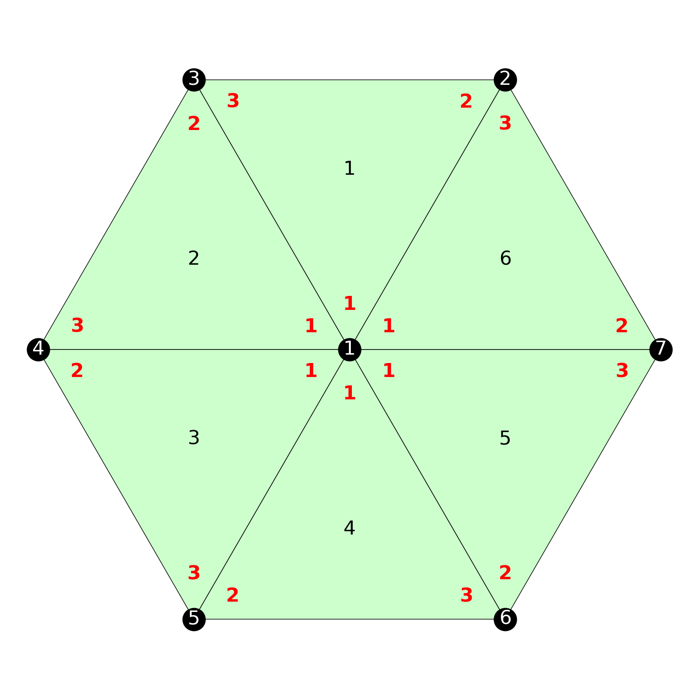

# TriMeshGame

[](https://github.com/ArjunNarayanan/TriMeshGame.jl/actions/workflows/CI.yml?query=branch%3Amain)

Credit to [Per-Olof Persson](persson.berkeley.edu) for giving me the idea and helping me out with this project.

This package implements connectivity editing operations on Triangular Meshes. A triangular mesh is a 2D mesh where all the elements are triangles. You can use the [MeshPlotter.jl](https://github.com/ArjunNarayanan/MeshPlotter.jl) for visualization. Check out the related [QuadMeshGame.jl](https://github.com/ArjunNarayanan/QuadMeshGame.jl) package for a similar approach with quadrilateral meshes.

# Introduction

A triangular mesh can be defined by providing the coordinates of vertices and the connectivity of each triangle. As an example, let's create a simple hexagonal mesh,

```julia
s = sqrt(3)/2
vertices = [0.0  1.0  0.5   -0.5  -1.0  -0.5  0.5
            0.0  0.0  s      s     0.0  -s    -s]

connectivity = [1  1  1  1  1  1
                3  4  5  6  7  2
                4  5  6  7  2  3]

mesh = TM.Mesh(vertices, connectivity)
```

`vertices` is expected to be a `2 x num_vertices` matrix of vertex coordinates, `connectivity` is expected to be a `3 x num_triangles` matrix of integers representing the connectivity of each triangle (one triangle per column). The vertices are assumed to be in counter-clockwise order. The order of the connectivity can be used to locally order the edges of each triangle.

The `Mesh` object is dynamic. The number of vertices and triangles can change based on the connectivity editing operations described later. Hence we allocate a larger buffer to store the vertex coordinates and triangle connectivity and we keep track of **active vertices** and **active triangles**. While visualizing, we should only supply the active vertices and active triangles to the plotter. We can do this as follows,

```julia
MP.plot_mesh(TM.active_vertex_coordinates(mesh), TM.active_triangle_connectivity(mesh), number_vertices = true, number_elements = true, internal_order = true)
```


The red numbering in the above figure refer to the local numbering of vertices in each quad. Each vertex can be uniquely associated with an edge in many ways - we choose to associate the edge opposite the vertex. So for example, local edge 1 in triangle 6 refers to the directed edge from vertex 2 to vertex 3. (The local edges are oriented in counter-clockwise order.)

Let's create a simple helper function for plotting,

```julia
function plot_verbose(mesh)
    fig = MP.plot_mesh(TM.active_vertex_coordinates(mesh), TM.active_triangle_connectivity(mesh), number_vertices = true,
    number_elements = true, internal_order = true)
    return fig
end
```

The `Mesh` object contains some useful information. You can look at the connectivity between triangles. This tells you the index of the neighboring triangle across a particular local edge.

```julia
julia> t2t = TM.active_triangle_t2t(mesh)
3×6 Matrix{Int64}:
 0  0  0  0  0  0
 2  3  4  5  6  1
 6  1  2  3  4  5
```

`t2t[3,1] = 6` says that the neighbor of triangle 1 across local edge 3 is triangle 6. A value of zero indicates that there is no neighbor (i.e. it is a boundary edge.)

You can obtain the local edge of your neighbor (the twin edge) as follows,

```julia
julia> t2n = TM.active_triangle_t2n(mesh)
3×6 Matrix{Int64}:
 0  0  0  0  0  0
 3  3  3  3  3  3
 2  2  2  2  2  2
```

How do we interpret `t2n`? Notice in the figure that the neighbor of triangle 4 across local edge 2 is triangle 5. Note also that triangle 5 has triangle 4 as neighbor across local edge 3. This is what is stored in `t2n` as `t2n[2,4] = 3`. In particular, if a particular edge is not a boundary,

```julia
t2t[t2n[e, t], t2t[e, t]] == t
```

Effectively, the `t2t` and `t2n` matrices encode the [half-edge datastructure](https://cs184.eecs.berkeley.edu/sp19/article/15/the-half-edge-data-structure) which is an effective data-structure to store and manipulate the topology of meshes. What we have been referring to as "local edges" are in-fact half-edges. We will refer to them as half-edges henceforth.

We can look at the degree (i.e. number of incident edges) of all active vertices,

```julia
julia> TM.active_vertex_degrees(mesh)
7-element Vector{Int64}:
 6
 3
 3
 3
 3
 3
 3
```

You can use the `circlemesh(num_ref)` function to create a uniform circular mesh where `num_ref` controls the refinement level,

```julia
mesh = TM.circlemesh(2)
fig = plot_verbose(mesh)
```


# Mesh Editing Operations

All mesh editing operations are defined in terms of half edges,

## Edge Flips

An edge flip rotates an edge to get a new triangular mesh. The syntax is `edgeflip!(mesh, triangle_index, local_half_edge_index)`. (Recall once again that `local_half_edge_index` 3 is the half-edge opposite local vertex 3 in a given triangle.) Here's an example,

```julia
mesh = TM.circlemesh(0)
TM.edgeflip!(mesh, 5, 2)
fig = plot_verbose(mesh)
```

 


Starting from an initial mesh, if we flip the same half-edge twice we come back to the 